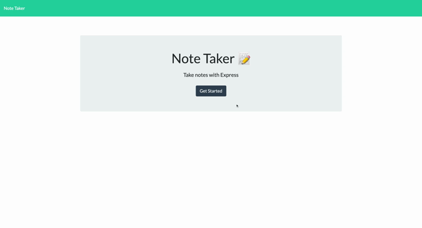

# Note Taker
## Table of Contents
* [Description](#description)
* [Built With](#languages)
* [Installation](#installation)
* [Contributing](#contributing)
* [Usage](#usage)
* [Testing](#tests)
* [Questions](#questions)
* [Application Preview](#application-preview)

    
       

## [Description](#table-of-contents)
A front-end note-taking app that allows users to add and delete personal notes.

## [Languages](#table-of-contents)
HTML, CSS/Bootstrap, JavaScript, Node.js, Express.js

## [License](#table-of-contents)
The application is covered under the following license:  
    [MIT](https://choosealicense.com/licenses/MIT)
      
      

## [Usage](#table-of-contents)
Visit live heroku website.

## [Contributing](#table-of-contents)

Thank you for your interest in contributing to this project, however, I am currently not accepting third party contributions.
      

## [Installation](#table-of-contents)
Visit https://note-taker-jess.herokuapp.com/ and click 'Get Started'

## [Application Preview](#table-of-contents)
Click the image to see the live site.

## [Questions](#table-of-contents)
Questions? Please contact me at the following links:  
[GitHub](https://github.com/jessica-calderon)  
[Email: calderonjessica13@yahoo.com](mailto:calderonjessica13@yahoo.com)
